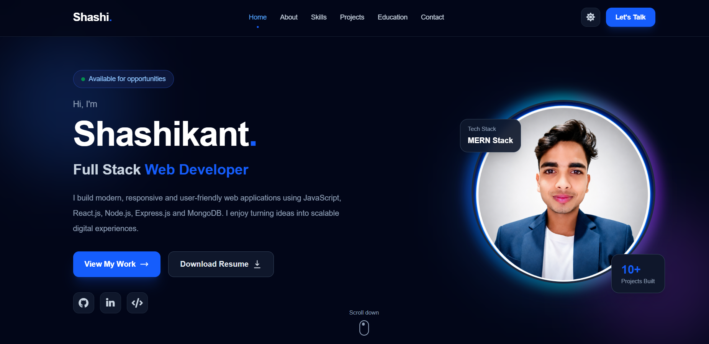

# 🌐 Shashikant - Personal Portfolio

A modern, responsive and professional personal portfolio website built with
React.js and Tailwind CSS.

The portfolio showcases my skills, projects, education, development journey
and contact information.

---

## 🚀 Live Demo

🔗 **Live Portfolio:**  
https://shashikant-portfolio-zeta.vercel.app/

> Replace the above URL with your actual Netlify live URL.

---

## 📸 Portfolio Preview



---

## ✨ Features

- 🎨 Modern and professional UI
- 📱 Fully responsive design
- 🌙 Dark / Light mode
- ⚡ React + Vite
- 🎯 Smooth scrolling navigation
- 🔥 Scroll reveal animations
- 🧑‍💻 Skills showcase
- 🚀 Project showcase
- 🎓 Education & development journey
- 📩 Contact section
- 🔗 GitHub, LinkedIn and LeetCode links
- 📄 Resume download
- 📱 Mobile-friendly navigation
- ♿ Reduced-motion accessibility support

---

## 🛠️ Technologies Used

### Frontend

- React.js
- JavaScript (ES6+)
- HTML5
- Tailwind CSS
- Vite

### Tools

- Git
- GitHub
- VS Code
- Font Awesome

---

## 📂 Project Structure

```text
portfolio/
│
├── public/
│   ├── profile.jpg
│   ├── resume.pdf
│   └── portfolio-preview.png
│
├── src/
│   ├── components/
│   │   ├── Navbar.jsx
│   │   ├── Hero.jsx
│   │   ├── About.jsx
│   │   ├── Skills.jsx
│   │   ├── Projects.jsx
│   │   ├── Education.jsx
│   │   ├── Contact.jsx
│   │   └── Footer.jsx
│   │
│   ├── data/
│   │   └── projects.js
│   │
│   ├── App.jsx
│   ├── index.css
│   └── main.jsx
│
├── .gitignore
├── index.html
├── package.json
├── README.md
└── vite.config.js
